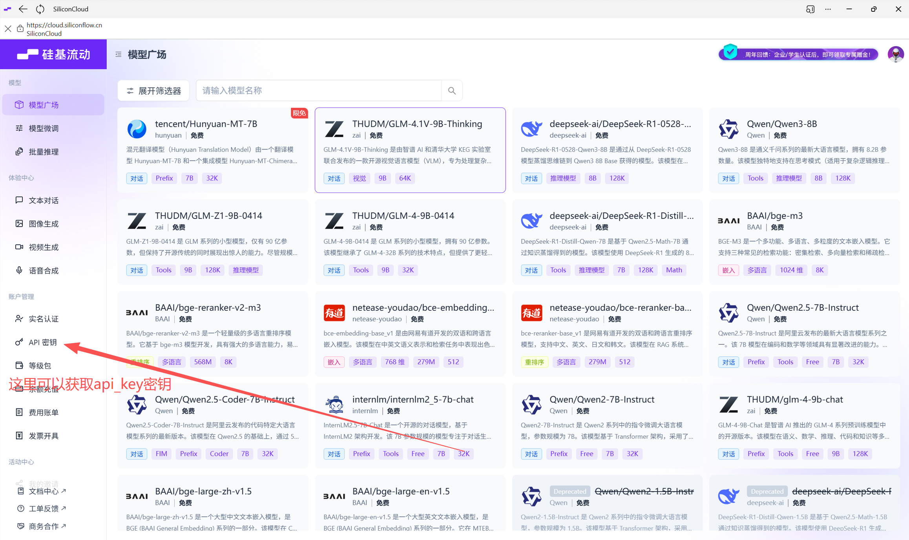
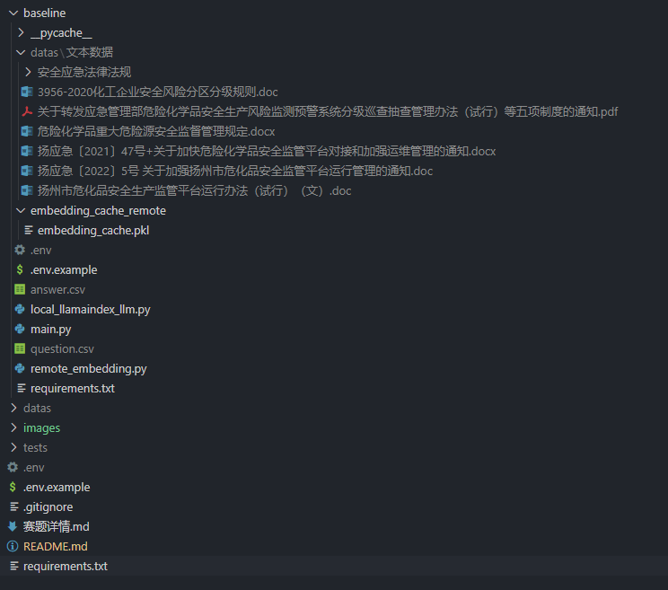
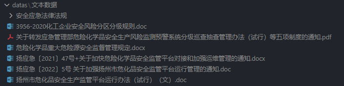
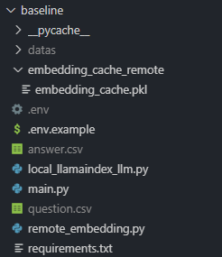

## 环境准备

环境创建：

```bash
conda create -n Smart-Emergency-Response python=3.10
```

激活环境：

```bash
conda activate Smart-Emergency-Response
```

依赖安装：

```bash
pip install -r requirements.txt
```

## 获取api_key

本次项目需要使用到大语言模型，由于本地部署的模型难以部署较大参数的模型，所以我们会选择使用兼容OpenAI的大语言模型服务商提供的api接口。

我这里使用的是硅基流动的api，因为他们上面有提供免费的embedding模型还有一些小参数的语言模型，用于基本的学习使用我觉得是合适的。

> 注意：不轨迹流动过上面有限速，如果你遇到限速的时候，我建议遇到报错之后，可以适当sleep一下，一般是动态刷新的，不过一般sleep的时间设置为10s或者50s应该是不会经常遇到限速报错了。

获取api_key的方法可以访问[硅基流动官网](https://cloud.siliconflow.cn/i/FcjKykMn),你也可以使用我的邀请码：`FcjKykMn`，我的邀请链接：<https://cloud.siliconflow.cn/i/FcjKykMn> 。**这样我可以获得2000 w的 token 奖励**。


## 配置环境变量

创建一个.env文件，将api_key写入其中，格式如下：

```bash
OPENAI_API_KEY=your_api_key_here
OPENAI_API_BASE=https://api.siliconflow.cn/v1 # 可以换成其他的服务商。
OPENAI_API_MODEL=Qwen/Qwen2.5-7B-Instruct
OPENAI_API_EMBEDDING_MODEL=BAAI/bge-m3
```

## baseline 目录结构

```text
/baseline
|-- datas/
|   |-- 文本数据/
|   |   |-- file1.docx
|   |   |-- file2.pdf
|   |   `-- ... (所有文本文件)
|-- .env
|-- .env.example
|-- main.py
|-- local_llamaindex_llm.py
|-- remote_embedding.py
`-- question.csv
```

## 数据准备

将赛题所需要的数据放到对应的目录下，完整的目录是这样的：

我们的数据集需要放到baseline目录下的datas文件夹内，注意可以直接将数据集内的文本数据文件夹直接复制到 datas 下面即可，在进阶环节你可以使用表格的数据放到 datas 下面。


## 运行 baseline 的主程序

确保你已经切换到 baseline 目录下，然后执行下面的命令。

```bash
python main.py
```

## 运行之后的目录结构

运行之后baseline目录下会生成answer.csv文件，里面是所有问题对应的答案。

